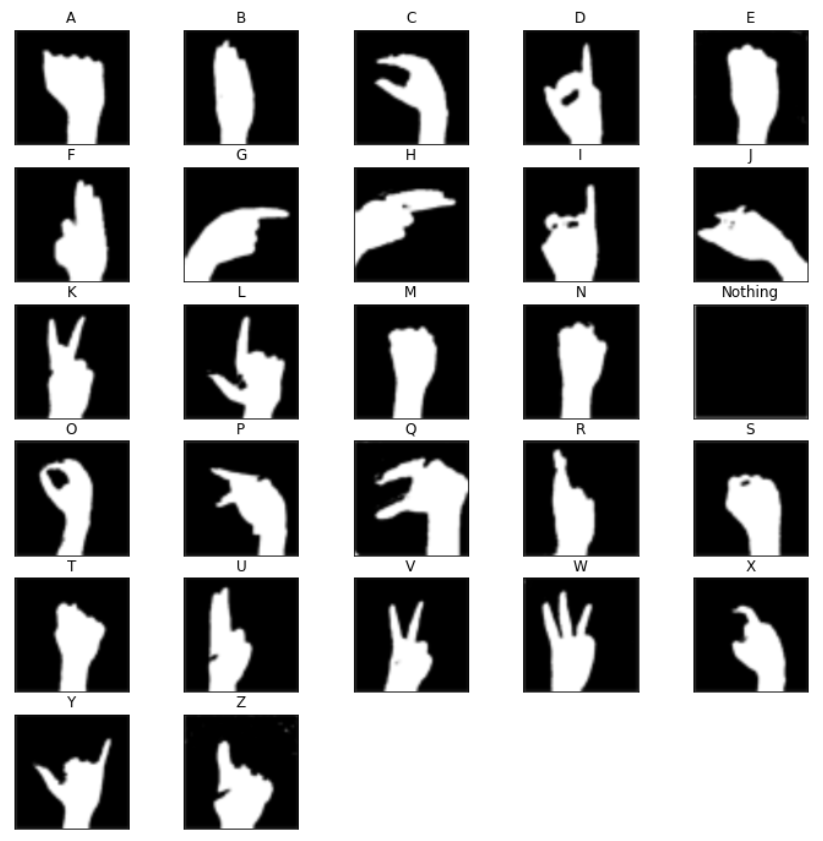

# Sign Language Recognition Using Convolutional Neural Network

## Description:
American Sign Language (ASL) is a natural language that serves as the predominant sign language of Deaf communities in the United States and most of Anglophone Canada. ASL is a complete and organized visual language that is expressed by facial expression as well as movements and motions with the hands.Besides North America, dialects of ASL and ASL-based creoles are used in many countries around the world, including much of West Africa and parts of Southeast Asia.

Here we are restricting ourselves to recognition of English Alphabets only

We have created the Dataset manually using OpenCV. Each alphabet in the dataset contain about 2600 images. After splitting the dataset into training and testing set each contain around 63k and 7k examples. Each image is 50X50 pixel image

## Image representing the sign of alphabet from A-Z of American sign language

## Dataset Preparation

The Dataset was prepared using the web camera of laptop and python library OpenCV. There is total 27 class in our dataset which corresponds to alphabet from A-Z of ASL and an extra class “Nothing” is added which is shown when no sign is seen in front of the camera. For each class around 1300 images was captured using right hand. After capturing the images for each class. The images of each class were flipped horizontally in order to create the dataset for left hand too. Thus, each class now has 2600 images making the size of the dataset to around 70000 images. After Capturing, each image has undergone background subtraction technique which first finds the difference between the current frame and the reference frame (called background frame) and then use thresholding (In thresholding, each pixel value is compared with the threshold value. If the pixel value is smaller than the threshold, it is set to 0, otherwise, it is set to a maximum value (generally 255)) followed by Gaussian smoothing (help to reduce noise) and erosion (help in removing noise and isolation of individual elements and joining disparate elements in an image). The image was then resized into 50X50 pixel and saved.
After performing the above process, we get a folder gesture which contain 27 sub-folders A-Z and “Nothing” each folder containing around 2600 images. Then a python code was written which help to convert the folder into a numpy array having 2501 columns and nearly 70000 rows. Each row corresponds to a single image in which first 2500 column were 50X50 pixel array flattened to 2500 and the last column contain the label for each image. The array was then stored as .npy file.

## preview of Dataset

## Training and saving the model 
The dataset which consists of nearly 70000 images is split into training, testing and validation test in the ratio of 0.83:0.1:0.07. The training data then has gone through data augmentation step (Data augmentation is a technique that help to create random variation in the training dataset like randomly rotating image to some angle, zooming in, shiftimage vertically or horizontally so that it generalizes well in the real-life data.). Then we are feeding the result of the data augmentation to our CNN model (optimizer – ADAM optimizer and metrics- Cross Entropy Metrics) with a mini-batch size (batch size is a hyperparameter that defines the number of samples to work through before updating the internal model parameters) of 256 i.e., each training set is split into nearly 228 mini-batches and feed to the model. The process is repeated for 50 epochs (The number of epochs is a hyperparameter that defines the number times that the learning algorithm will work through the entire training dataset) .
The model was saved as a h5 format file, and this was called during real time testing. For real time implementation, each video frame of the camera was processed and segmented based on background removal technique, finally passed through the called trained model for its classification.

## Result
The training accuracy came out to be 99.98% and when the trained model was used to classify the images in the test dataset the test accuracy came out to 99% i.e., the model was performing quite well and was classifying almost each image correctly.

## Entire code Link:
https://colab.research.google.com/drive/1HMnPAgKZY8To2gNraErXJhL-ptBUzWC5?usp=sharing

## Demonstration link:
https://drive.google.com/file/d/1V1Eszh6uDf6Ks5F_M8-TyQazGdoOUFsK/view?usp=sharing